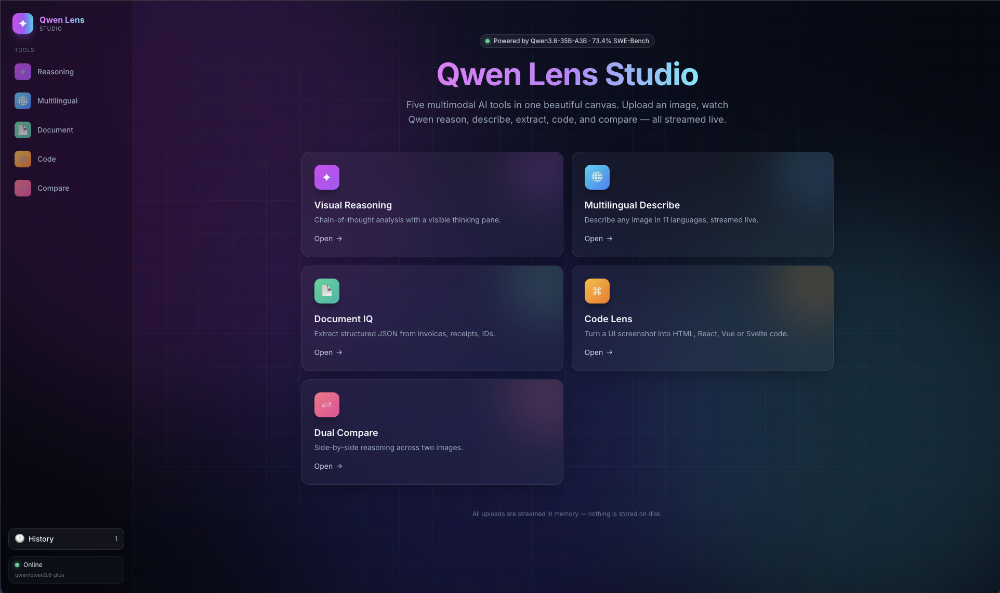
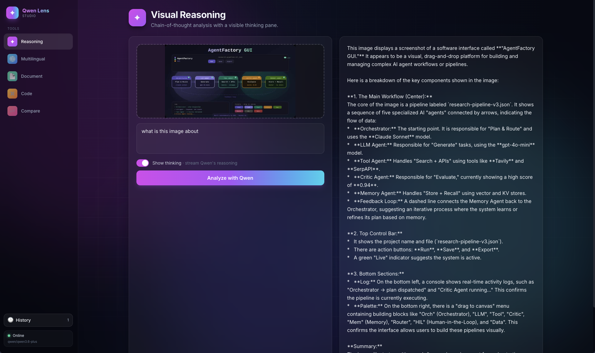
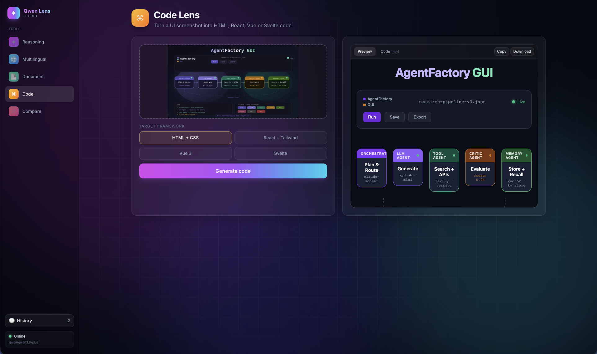

# Qwen Lens Studio ✦

> Built autonomously using **[NEO — Your Autonomous AI Engineering Agent](https://heyneo.com)**.
>
> [](https://marketplace.visualstudio.com/items?itemName=NeoResearchInc.heyneo)
> [](https://marketplace.cursorapi.com/items/?itemName=NeoResearchInc.heyneo)

Multimodal AI Studio powered by **Qwen3.6-35B-A3B**. Qwen Lens Studio is an end-to-end web application that turns a single multimodal model into a suite of production-ready visual tools — reasoning over images, describing them in multiple languages, extracting structured data from documents, converting UI screenshots into working frontend code, and comparing two images side by side.



## What it does
Qwen Lens Studio exposes Qwen 3.6's vision-language capabilities through a polished React SPA backed by a FastAPI server. Upload an image (or two), pick a tool, and get back structured, useful output — whether that's a reasoned answer, a translation, JSON, or runnable component code. It is backend-agnostic: point it at OpenRouter, a local Ollama instance, or llama.cpp.

The studio is designed to be a practical, self-hosted alternative to closed vision APIs. Everything runs behind a single FastAPI process, the UI is a static React bundle, and the model calls are routed through a thin backend abstraction so you can switch providers without touching the frontend. This makes it equally useful as a personal multimodal playground, an internal tool for ops and data teams, or a starting point for a domain-specific vision product.

## Why Qwen Lens Studio
- **One model, many workflows** — instead of stitching together separate services for OCR, captioning, code generation, and reasoning, a single Qwen 3.6 deployment powers every tool in the studio.
- **Own your stack** — run locally against Ollama or llama.cpp for privacy-sensitive data, or point at OpenRouter when you just want to ship.
- **Built for iteration** — the "Show Thinking" toggle, structured JSON outputs, and side-by-side compare mode are designed for prompt engineers and analysts who need to inspect *why* the model answered the way it did.
- **Autonomously engineered with NEO** — the entire codebase (backend, frontend, tooling) was planned and implemented by NEO, showcasing what an autonomous AI engineering agent can ship end-to-end.

## Features
- **Visual Reasoning** — Chain-of-thought analysis with a "Show Thinking" toggle so you can inspect the model's reasoning steps.
- **Multilingual Describe** — Generate image descriptions in 11 languages for captioning, accessibility, or localization workflows.
- **Document IQ** — Extract structured JSON (fields, tables, key-value pairs) from receipts, forms, invoices, and other documents.
- **Code Lens** — Convert a UI screenshot into production-ready React, Vue, Svelte, or plain HTML code.
- **Dual Compare** — Side-by-side analysis of two images for diffs, A/B reviews, or change detection.
- **Pluggable backends** — Swap between OpenRouter, Ollama, and llama.cpp with a single environment variable.
- **Modern SPA UI** — React + Vite frontend with hot-reload dev mode and a production build served by FastAPI.

## Use cases
- **Product & design teams** — drop in a Figma export or screenshot and get a working component scaffolded in your framework of choice.
- **Ops & finance** — batch-extract line items from invoices, receipts, or forms into clean JSON ready for downstream pipelines.
- **Accessibility & localization** — generate alt text and translated descriptions for large image libraries in one pass.
- **Research & QA** — use Dual Compare to spot regressions between screenshot runs or visual diffs between two documents.
- **Education & prompting** — the Show Thinking toggle makes Qwen Lens Studio a great teaching tool for visual chain-of-thought prompting.

## Architecture at a glance
```
┌──────────────────────────┐        ┌─────────────────────────────┐
│  React + Vite SPA        │  REST  │  FastAPI (app.py)           │
│  Tool panels, uploads,   │ ─────► │  Routes: /api/reasoning,    │
│  streaming results       │        │  /api/multilingual,         │
└──────────────────────────┘        │  /api/document-iq,          │
                                    │  /api/code-lens,            │
                                    │  /api/dual-compare          │
                                    └──────────────┬──────────────┘
                                                   │
                              ┌────────────────────┴────────────────────┐
                              │  Backend adapter (OpenRouter / Ollama / │
                              │  llama.cpp) → Qwen 3.6 35B A3B          │
                              └─────────────────────────────────────────┘
```

- **Frontend**: React + Vite SPA. In production it's built once and served as static assets by FastAPI; in development it runs on `:5173` and proxies `/api` calls to the backend on `:8000`.
- **Backend**: FastAPI exposes one endpoint per tool, handles image encoding, prompt assembly, and streams responses back to the UI.
- **Model layer**: a thin adapter selects the inference backend at startup based on `BACKEND` / `MODEL_ID` env vars.

### Visual Reasoning


### Code Lens


## Setup
1. Clone the repository.
2. Install dependencies:
   ```bash
   pip install -r requirements.txt
   ```
3. Configure environment:
   ```bash
   cp .env.example .env
   # Add your OPENROUTER_API_KEY
   ```
4. Build the frontend (React + Vite SPA):
   ```bash
   cd frontend
   npm install
   npm run build
   cd ..
   ```
5. Run the application:
   ```bash
   uvicorn app:app --reload
   ```
   Open http://localhost:8000 to use the new Qwen Lens Studio UI.

### Frontend dev mode
For hot-reloading while editing the UI:
```bash
# terminal 1 — backend
uvicorn app:app --reload --port 8000
# terminal 2 — frontend (proxies /api → :8000)
cd frontend && npm run dev
```
Then visit http://localhost:5173.

## Model Info
- **Model**: Qwen 3.6 35B A3B
- **Architecture**: 35B MoE (3B active parameters)
- **Context**: 262K tokens
- **Performance**: 73.4% SWE-bench Verified

### Model IDs by Backend
| Backend | Model ID |
|---------|----------|
| OpenRouter (default, `BACKEND=openrouter`) | `qwen/qwen3.6-plus` |
| Ollama (`BACKEND=ollama`) | `qwen3.6:35b` |
| llama.cpp (`BACKEND=llamacpp`) | `qwen3.6-35b` |

Configure via environment variables `MODEL_ID` and `BACKEND`. For self-hosted backends you can also override `OLLAMA_BASE_URL` or `LLAMACPP_BASE_URL`.
